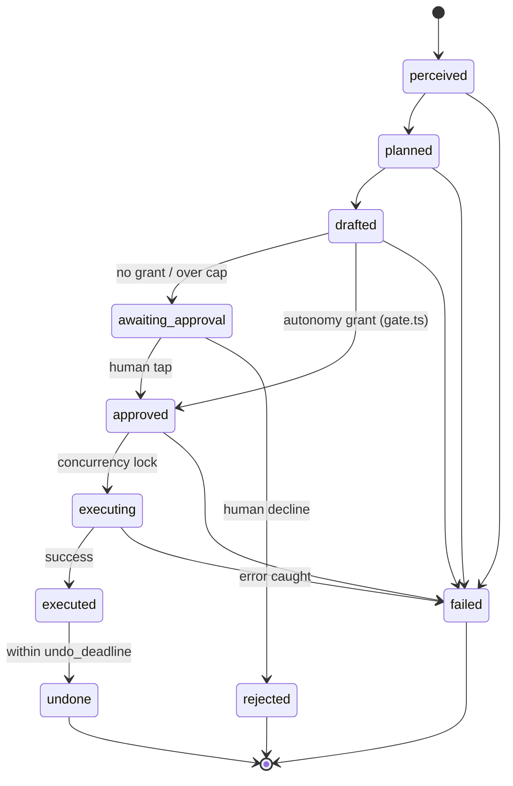
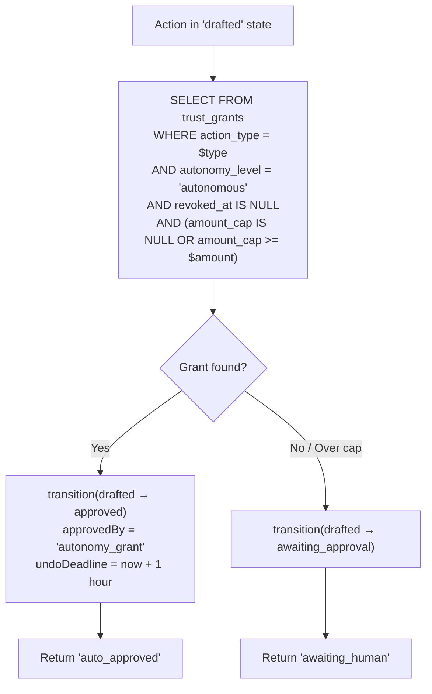
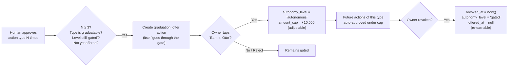
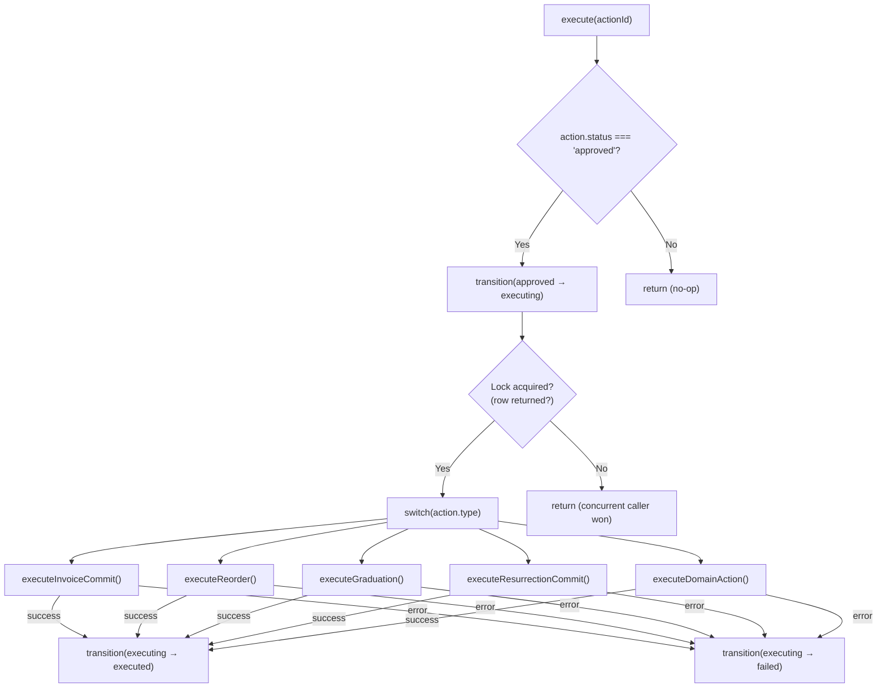
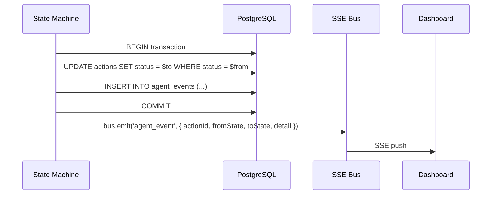

# Agent Workflow — Deep Dive

> **Scope:** Complete technical reference for Otto's agent loop, from action creation to execution, undo, and trust graduation.
> **Source files:** [`machine.ts`](file:///c:/Users/gunde/Desktop/otto/src/agent/machine.ts), [`gate.ts`](file:///c:/Users/gunde/Desktop/otto/src/agent/gate.ts), [`trust.ts`](file:///c:/Users/gunde/Desktop/otto/src/agent/trust.ts), [`executors.ts`](file:///c:/Users/gunde/Desktop/otto/src/agent/executors.ts), [`triggers.ts`](file:///c:/Users/gunde/Desktop/otto/src/agent/triggers.ts), [`domain-engine.ts`](file:///c:/Users/gunde/Desktop/otto/src/agent/domain-engine.ts)

---

## 1. The PostgreSQL State Machine

Otto's agent is a **database-driven state machine**. An action is a row in the `actions` table. A transition is a SQL `UPDATE` inside a transaction. State lives in PostgreSQL — not in process memory — so the agent survives restarts, and concurrent callers resolve via optimistic locking.

### 1.1 The 10 States

```typescript
export type ActionStatus =
  | 'perceived'          // Action created — event noticed
  | 'planned'            // Reasoning attached
  | 'drafted'            // Ready for routing decision
  | 'awaiting_approval'  // Queued for human review
  | 'approved'           // Green-lit — human tap or autonomy grant
  | 'rejected'           // Human declined (terminal)
  | 'executing'          // Side-effects in progress (concurrency lock)
  | 'executed'           // Completed successfully
  | 'undone'             // Reversed within undo window (terminal)
  | 'failed';            // Error during any non-terminal phase (terminal)
```

### 1.2 The TRANSITIONS Map — Every Legal Edge

The `TRANSITIONS` constant in `machine.ts` (line 40) defines every permitted state change. Any transition not in this map throws `Error('illegal transition ${from} → ${to}')`.



| From | → To | Notes |
|---|---|---|
| `perceived` | `planned`, `failed` | Initial processing |
| `planned` | `drafted`, `failed` | Reasoning attached, draft prepared |
| `drafted` | `awaiting_approval`, `approved`, `failed` | `approved` directly = autonomy grant bypass (gate.ts) |
| `awaiting_approval` | `approved`, `rejected` | Human decision only |
| `approved` | `executing`, `failed` | `approved→executing` is the concurrency lock |
| `executing` | `executed`, `failed` | Side-effects complete or error |
| `executed` | `undone` | Only within `undo_deadline` (enforced in `undoAction()`) |
| `rejected` | *(none — terminal)* | |
| `undone` | *(none — terminal)* | |
| `failed` | *(none — terminal)* | |

---

## 2. Action Lifecycle

### 2.1 Creation — `createAction()`

[`machine.ts:67-86`](file:///c:/Users/gunde/Desktop/otto/src/agent/machine.ts#L67-L86)

```sql
INSERT INTO actions (type, payload, reasoning, amount)
VALUES ($type, $payload, $reasoning, $amount)
RETURNING *
```

Every new action starts in `perceived`. An `agent_events` row is immediately inserted with `from_state: null, to_state: 'perceived'` — the action's birth certificate.

### 2.2 Drafting — `draftAction()`

[`machine.ts:140-147`](file:///c:/Users/gunde/Desktop/otto/src/agent/machine.ts#L140-L147)

Drives the action through two rapid transitions:
1. `perceived → planned` — reasoning is recorded
2. `planned → drafted` — action is ready for routing

Each transition emits an `agent_events` row. The reasoning text is also persisted directly on the action row via a separate `UPDATE`.

### 2.3 The Transition Function — `transition()`

[`machine.ts:92-137`](file:///c:/Users/gunde/Desktop/otto/src/agent/machine.ts#L92-L137)

This is the core primitive of the entire agent:

```typescript
export async function transition(
  actionId: string,
  from: ActionStatus,
  to: ActionStatus,
  patch: {
    approvedBy?: 'human' | 'autonomy_grant';
    trustGrantId?: string;
    undoDeadline?: Date;
    payloadMerge?: Record<string, unknown>;
    detail?: Record<string, unknown>;
  } = {},
): Promise<ActionRow | null>
```

**Implementation** (inside `sql.begin()` transaction):

```sql
UPDATE actions SET
  status        = $to,
  approved_by   = COALESCE($approvedBy, approved_by),
  trust_grant_id= COALESCE($trustGrantId, trust_grant_id),
  undo_deadline = COALESCE($undoDeadline, undo_deadline),
  payload       = payload || $payloadMerge,
  updated_at    = now()
WHERE id = $actionId AND status = $from
RETURNING *
```

```sql
INSERT INTO agent_events (action_id, from_state, to_state, detail)
VALUES ($actionId, $from, $to, $detail)
```

**Key properties:**

1. **Guard clause** — `TRANSITIONS[from]?.includes(to)` is checked *before* the query. Illegal transitions throw immediately.
2. **Optimistic lock** — `WHERE status = $from` means if the row's status has already changed, `UPDATE` matches 0 rows, the function returns `null`, and the caller treats it as a clean no-op.
3. **Atomic audit** — the `agent_events` INSERT is in the same transaction as the status UPDATE. No transition goes unlogged.
4. **SSE notification** — after commit, `bus.emit('agent_event', ...)` nudges SSE listeners. The bus is just a signal — the data is already persisted.

---

## 3. Idempotency Guarantees

The `WHERE status = $expected` clause is the single mechanism that provides idempotency across the entire system:

### 3.1 The Pattern

```sql
WHERE id = $actionId AND status = $from
```

If a concurrent caller has already moved the action past `$from`, this `UPDATE` matches 0 rows. The function returns `null`. The caller interprets `null` as "someone got there first — nothing to do."

### 3.2 Scenarios Protected

| Scenario | What Happens |
|---|---|
| **Double-tap on approve** | Second `awaiting_approval → approved` matches 0 rows → no-op |
| **SSE replay** | Re-processing an event cannot re-transition an already-moved action |
| **Re-fired trigger** | `scanReorderTriggers()` checks for open reorders via `NOT EXISTS`; even if it fires twice, the second `createAction` + `draftAction` + `routeDraftedAction` sequence cannot double-execute because `execute()` does `approved → executing` which only succeeds once |
| **Concurrent executors** | Two callers call `execute(id)` — first wins `approved → executing`; second gets `null` and returns |

### 3.3 No Distributed Locks

There are no Redis locks, no advisory locks, no file locks. The `WHERE` clause *is* the lock. PostgreSQL's row-level locking within the transaction handles the rest.

---

## 4. Concurrency Control

### 4.1 The Executing Lock

[`executors.ts:16-21`](file:///c:/Users/gunde/Desktop/otto/src/agent/executors.ts#L16-L21)

```typescript
export async function execute(actionId: string): Promise<void> {
  const action = await getAction(actionId);
  if (!action || action.status !== 'approved') return;

  const locked = await transition(actionId, 'approved', 'executing', {});
  if (!locked) return; // another caller won — clean no-op
  // ...side-effects run here
}
```

The `approved → executing` transition is the concurrency lock. Only one caller can win it. The loser gets `null` and exits without side-effects.

### 4.2 Transaction Isolation

Side-effect executors (like `executeInvoiceCommit`) wrap all mutations in `sql.begin()`:

```typescript
await sql.begin(async (tx) => {
  // resolve counterparty
  // stock mutations
  // invoice/ledger inserts
  // agent_events logging
});
```

All-or-nothing: if any step fails, the entire transaction rolls back.

---

## 5. Audit Trail — `agent_events`

Every state transition inserts a row into `agent_events`:

```sql
INSERT INTO agent_events (action_id, from_state, to_state, detail)
VALUES ($actionId, $from, $to, $detail)
```

The `detail` column is a JSONB payload that varies by transition:

| Transition | Detail Contents |
|---|---|
| `→ perceived` | `{ type, reasoning }` |
| `→ planned` | `{ reasoning }` |
| `→ drafted` | Context-specific (product info, domain metadata) |
| `→ awaiting_approval` | `{ card: 'graduation' }` or `{ grant_present_but_over_cap: true }` |
| `→ approved` | `{ via: 'autonomy_grant', cap }` or human approval context |
| `executing → executing` | Mid-execution progress: `{ step: 'side_effects_committed', ... }` or `{ step: 'po_sent', ... }` |
| `→ executed` | `{ auto: true/false }` — whether autonomy or human |
| `→ failed` | `{ error: message }` |
| `→ undone` | `{ step: 'po_cancelled', note: '...' }` |

Additionally, `emitAgentEvent()` fires SSE notifications for real-time UI updates. The SSE bus is a notification mechanism — the event is already durably persisted in `agent_events` before the bus fires.

---

## 6. The Approval Gate — Two Paths, No Third

[`gate.ts`](file:///c:/Users/gunde/Desktop/otto/src/agent/gate.ts) — 38 lines that define the safety property.

### 6.1 Gate Logic — `routeDraftedAction()`



### 6.2 Path 1: Human Approval

```
POST /api/approve → transition(actionId, 'awaiting_approval', 'approved', { approvedBy: 'human' })
```

After human approval, `recordHumanApproval(actionType)` is called — incrementing the approval count toward graduation.

### 6.3 Path 2: Autonomy Grant

The gate queries `trust_grants` for an active (`autonomy_level = 'autonomous'`), non-revoked (`revoked_at IS NULL`) grant whose `amount_cap` covers the action's amount. If found:

- `approved_by` = `'autonomy_grant'`
- `trust_grant_id` = the grant's ID
- `undo_deadline` = `Date.now() + 60*60*1000` (1 hour)

### 6.4 Over-Cap Fallback

If a grant exists but `amount_cap < action.amount`, the action falls through to `awaiting_approval` with `{ grant_present_but_over_cap: true }` in the event detail. The grant's existence is acknowledged but insufficient.

---

## 7. Trust Engine Integration

[`trust.ts`](file:///c:/Users/gunde/Desktop/otto/src/agent/trust.ts) — graduated autonomy lifecycle.

### 7.1 Approval Counting

```typescript
export async function recordHumanApproval(actionType: ActionType)
```

Uses PostgreSQL `INSERT ... ON CONFLICT DO UPDATE` to atomically increment `approvals_count`.

### 7.2 Graduation Ladder



### 7.3 Constants

| Constant | Value | Meaning |
|---|---|---|
| `GRADUATION_THRESHOLD` | `3` | Minimum human approvals before offering graduation |
| `DEFAULT_CAP_INR` | `10,000` | Default autonomy amount cap in ₹ |
| `UNDO_WINDOW_MS` | `3,600,000` (1 hour) | Window for reversing auto-approved actions |

### 7.4 Graduatable Action Types

```typescript
const GRADUATABLE: ActionType[] = [
  'reorder',
  'admission_processing',
  'attendance_report',
  ...THEME2_ACTION_TYPES,
];
```

Note: `invoice_commit` is **not** graduatable — financial commits always require human review.

---

## 8. Trigger System

[`triggers.ts`](file:///c:/Users/gunde/Desktop/otto/src/agent/triggers.ts) — event-driven rule evaluation.

### 8.1 Reorder Trigger Scan

`scanReorderTriggers()` is called after stock mutations (e.g., after an `invoice_commit` executor completes). It:

1. **Queries** products where `stock_qty <= reorder_point` and no open reorder exists in any active state (`perceived`, `planned`, `drafted`, `awaiting_approval`, `approved`, `executing`)
2. **Calculates** order parameters:
   - Quantity: `reorder_qty` or `max(reorder_point × 2, 5)`
   - Unit cost: last price from `price_history`, or `unit_price × 0.7` (documented heuristic)
3. **Consequence analysis**: days until stockout, remaining monthly budget
4. **Creates** a reorder action with full reasoning narration
5. **Routes** through the approval gate
6. **Executes** immediately if auto-approved

### 8.2 Deduplication

The `NOT EXISTS` subquery prevents duplicate reorders:

```sql
AND NOT EXISTS (
  SELECT 1 FROM actions a
  WHERE a.type = 'reorder'
    AND a.status IN ('perceived','planned','drafted','awaiting_approval','approved','executing')
    AND a.payload->>'product_id' = p.id::text
)
```

Only terminal states (`executed`, `undone`, `failed`, `rejected`) are excluded from the dedup check — ensuring a new reorder can be created after the previous one completes.

---

## 9. Executor Dispatch Pattern

[`executors.ts:16-49`](file:///c:/Users/gunde/Desktop/otto/src/agent/executors.ts#L16-L49)

### 9.1 Dispatch Flow



### 9.2 Error Handling

The executor wraps the entire `switch` block in `try/catch`:

- **Success**: `transition(actionId, 'executing', 'executed', { detail: { auto: ... } })`
- **Failure**: `transition(actionId, 'executing', 'failed', { detail: { error: message } })`

The error is then re-thrown after recording the failure, allowing upstream error handlers to log or alert.

---

## 10. Domain Action Execution

### 10.1 Domain Engine Orchestration

[`domain-engine.ts`](file:///c:/Users/gunde/Desktop/otto/src/agent/domain-engine.ts) runs Theme 2 playbooks:

1. `runOttoWorkflow()` — executes the domain-specific workflow engine
2. `createAction()` — creates an action with the full playbook payload (problem statement, workflow steps, approval chain, impact analysis, confidence, draft format)
3. `draftAction()` — perceived → planned → drafted with playbook metadata
4. `routeDraftedAction()` — gate decision
5. `execute()` — if auto-approved

### 10.2 Domain Executor

[`executors.ts:158-193`](file:///c:/Users/gunde/Desktop/otto/src/agent/executors.ts#L158-L193)

Domain actions mark the approved packet as ready (`domain_status: 'approved_packet_ready'`) and emit a detailed event. In MVP mode, external domain systems are "connector-ready, not mutated" — the integration boundary is declared but not crossed.

### 10.3 Domain Undo

[`executors.ts:270-286`](file:///c:/Users/gunde/Desktop/otto/src/agent/executors.ts#L270-L286)

Domain actions support undo within the 1-hour window by setting `domain_status: 'reversed'` and emitting a `domain_action_reversed` event. Since external systems were not mutated in MVP mode, the undo is purely internal.

---

## 11. Resurrection Pipeline Integration

[`resurrection.ts`](file:///c:/Users/gunde/Desktop/otto/src/agent/resurrection.ts) — the Flow 0 batch pipeline — creates a single `resurrection_commit` action that:

1. Extracts all uploaded documents (per-doc cache, failures logged but non-fatal)
2. Resolves entities across documents (one LLM pass)
3. Runs deterministic inference (stock levels, reorder points, dues) — see `inference.ts`
4. Stages everything on the action's `payload` (nothing goes live)
5. Transitions to `awaiting_approval` with a summary card
6. On approval, the `resurrection_commit` executor bulk-inserts all entities atomically

The resurrection commit executor deliberately does **not** trigger a reorder scan — low-stock findings are narrated during the build, and reorder agents wake on the next real stock event (pacing for demo narrative).

---

## 12. SSE Event Flow



The bus is imported dynamically (`await import('@/lib/sse')`) to avoid circular dependencies. The event data is already persisted before the bus fires — the SSE notification is just a signal to update the UI.
