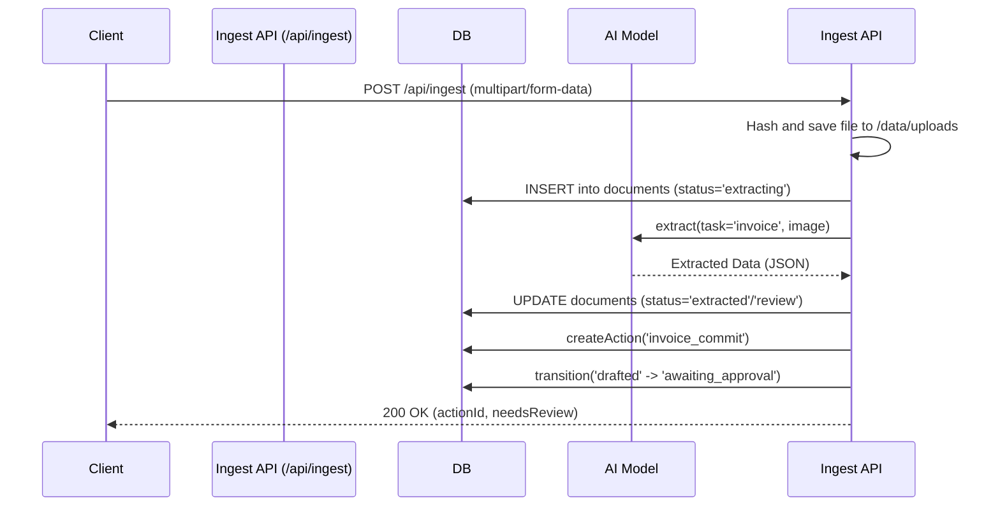
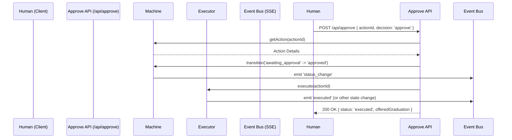
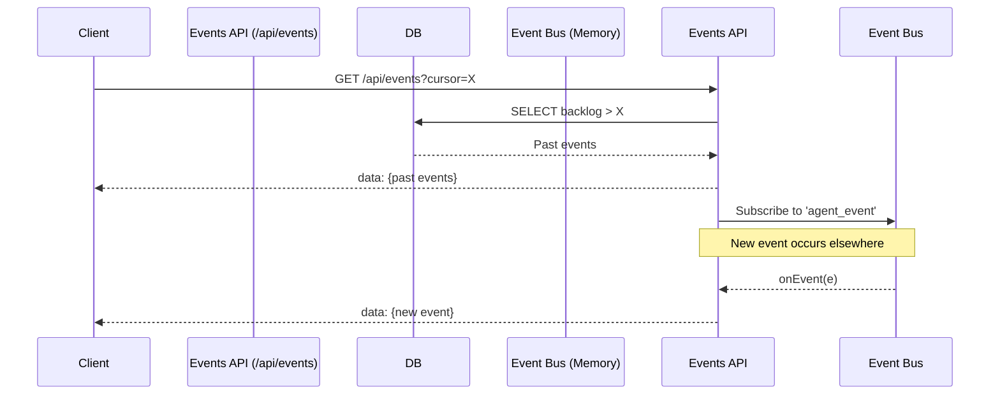

# API Sequence Diagrams

Below are the key sequence diagrams illustrating the data flow across Otto's core subsystems.

## 1. Document Ingestion Flow

The ingestion flow processes uploaded invoices and places the resulting draft action into the approval queue.

## 2. Approval Gate Flow

This diagram illustrates how a human approves an agent's drafted action.

## 3. Real-time Events Stream (SSE)

The events flow maintains client state synchronization.

