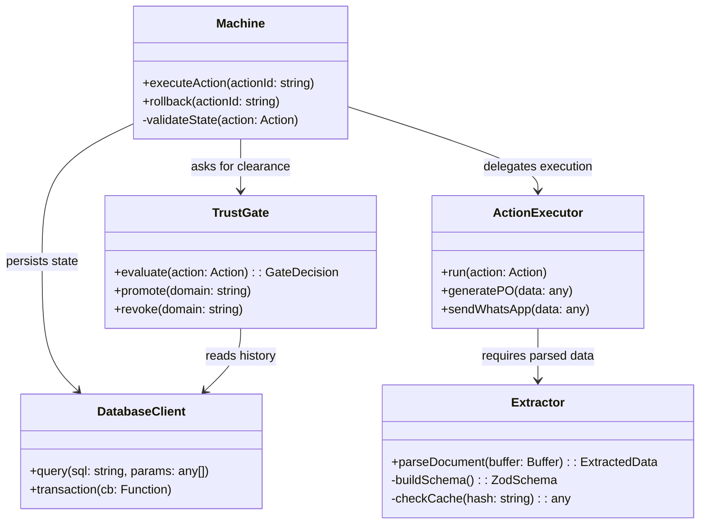

# C4 Code Diagram

## Overview
This diagram represents the structural layout and code-level interactions within the core domain of the Agent module (`src/agent/`).

## Diagram

```mermaid
classDiagram
    direction TB
    
    class Machine {
        +executeAction(actionId: string)
        +rollback(actionId: string)
        -validateState(action: Action)
    }
    
    class TrustGate {
        +evaluate(action: Action): GateDecision
        +promote(domain: string)
        +revoke(domain: string)
    }
    
    class Extractor {
        +parseDocument(buffer: Buffer): ExtractedData
        -buildSchema(): ZodSchema
        -checkCache(hash: string): any
    }
    
    class ActionExecutor {
        +run(action: Action)
        +generatePO(data: any)
        +sendWhatsApp(data: any)
    }
    
    class DatabaseClient {
        +query(sql: string, params: any[])
        +transaction(cb: Function)
    }

    Machine --> TrustGate : asks for clearance
    Machine --> ActionExecutor : delegates execution
    Machine --> DatabaseClient : persists state
    ActionExecutor --> Extractor : requires parsed data
    TrustGate --> DatabaseClient : reads history
```
