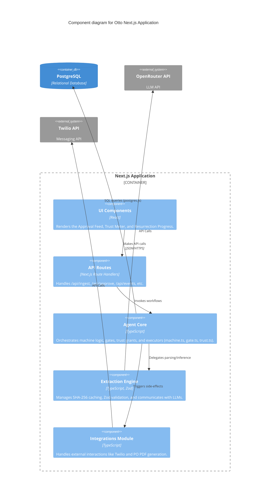

# C4 Component Diagram

## Overview
This diagram zooms into the Next.js Application container to show its internal components, specifically highlighting the Agent Core and Extraction modules.

## Diagram

