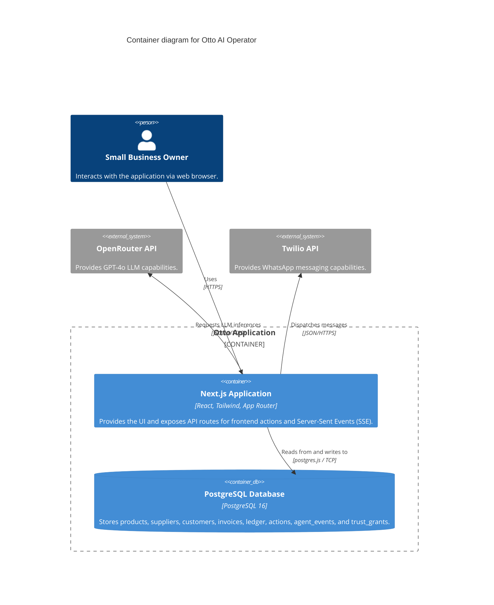

# C4 Container Diagram

## Overview
This diagram shows the high-level containers that make up the Otto system. It illustrates how the Next.js application interacts with the database and external APIs.

## Diagram

