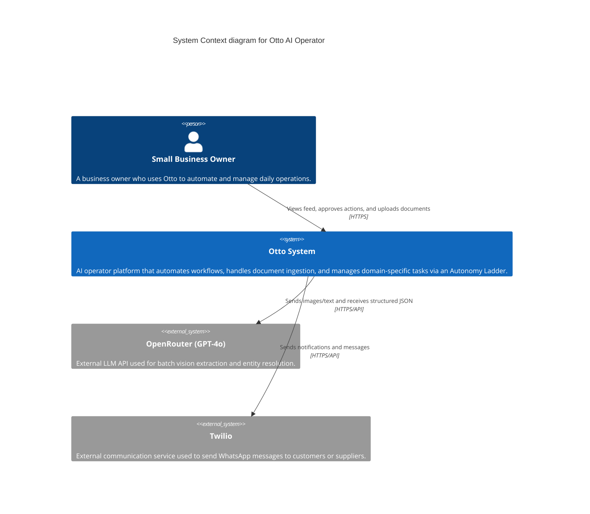

# C4 Context Diagram

## Overview
This diagram illustrates the system context for Otto, showing the boundaries between the users, the Otto application, and external third-party systems.

## Diagram

