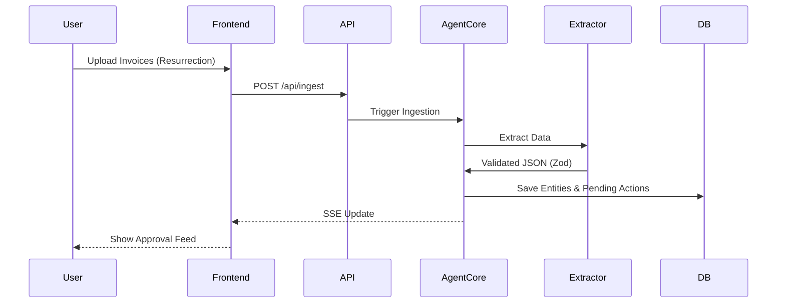

# High Level Design (HLD)

## 1. System Overview
The Otto system is built on a monolithic architecture using Next.js 14 to serve both the client-side UI and the backend API routes. The primary domain logic is housed within the "Agent Core".

## 2. Core Modules

### 2.1 Next.js Frontend
- **Approval Feed:** Central hub for human-gated actions.
- **Resurrection Progress:** UI for batch vision extraction pipeline.
- **Trust Meter:** Visual indicator of the agent's earned autonomy.

### 2.2 Next.js API Layer
- **Routes:** `/api/ingest`, `/api/approve`, `/api/events` (SSE), `/api/trust`.

### 2.3 Agent Core
Manages the lifecycle of automated tasks, validations, and the "Autonomy Ladder". Includes:
- **State Machine:** Tracks status transitions (e.g., pending -> approved -> executed).
- **Gate/Trust Controllers:** Decides if an action requires human approval or can execute autonomously based on past human approvals.

### 2.4 Extraction Engine
- Connects to OpenRouter for AI inference.
- Implements Zod validation and a local SHA-256 file cache.

### 2.5 Database
PostgreSQL 16 instance storing domain entities (products, customers) and agent state (actions, events, trust grants).

## 3. Data Flow Diagram

