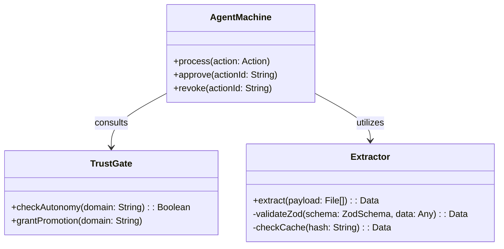

# Low Level Design (LLD)

## 1. Agent Core Architecture
The `src/agent/` directory contains the core logic of the Otto system. It is purposefully hand-rolled to ensure simplicity and safety.

## 2. Key Components

### 2.1 State Machine (`machine.ts`)
Manages the transitions of workflows. Uses idempotent SQL operations:
`UPDATE actions SET status = $to WHERE id = $id AND status = $from`

### 2.2 Trust Module (`trust.ts` & `gate.ts`)
Calculates the autonomy score based on historical actions.
- If approval count > threshold, the system triggers a promotion request.
- Handles revocability and action capping.

### 2.3 Extraction & Zod Validation (`extract/`)
Ensures that all LLM responses strictly conform to system expectations.
- **Input:** Unstructured text/images.
- **Schema:** Zod defined output model.
- **Cache:** SHA-256 hash of inputs.

### 2.4 Integrations
- **WhatsApp:** Simulates or connects via Twilio to send customer updates.
- **PO Generator:** Generates HTML/PDF Purchase Orders from structured data.

## 3. Class/Component Structure

