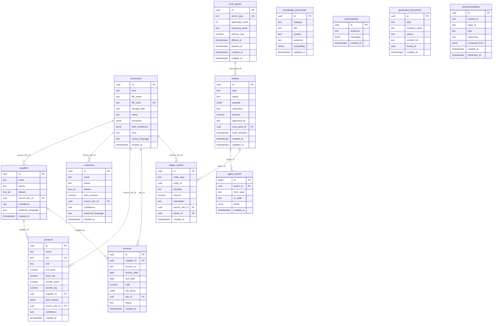
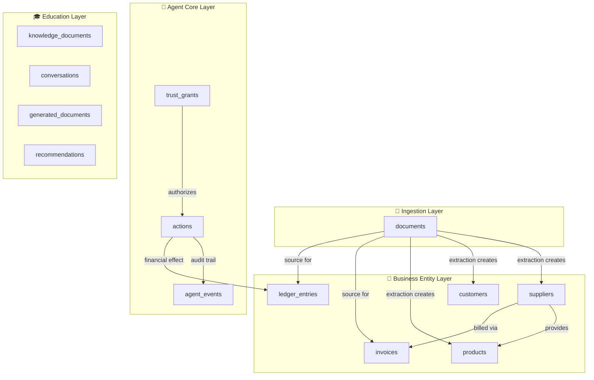

# Entity-Relationship Diagram

> **Source**: All relationships derived from foreign keys in [`001_init.sql`](file:///c:/Users/gunde/Desktop/otto/db/migrations/001_init.sql) through [`004_theme2_domain_engine.sql`](file:///c:/Users/gunde/Desktop/otto/db/migrations/004_theme2_domain_engine.sql).

---

## Full ER Diagram

---

## Relationship Descriptions

### 1. `documents` → `suppliers` (One-to-Many)

**FK**: `suppliers.source_doc_id → documents.id`
**Cardinality**: One document can create zero or more suppliers (a single invoice image may contain a new vendor). A supplier has at most one source document — the document from which it was first extracted.

### 2. `documents` → `customers` (One-to-Many)

**FK**: `customers.source_doc_id → documents.id`
**Cardinality**: One document can create zero or more customers (a ledger page photo can contain multiple customer entries). Each customer links back to its source document for provenance.

### 3. `documents` → `products` (One-to-Many)

**FK**: `products.source_doc_id → documents.id`
**Cardinality**: One invoice or receipt document can create multiple new product entries. Each product retains a reference to the document it was first extracted from.

### 4. `documents` → `invoices` (One-to-Many)

**FK**: `invoices.doc_id → documents.id`
**Cardinality**: One uploaded document maps to one invoice record (the typical case). The FK column is named `doc_id` rather than `source_doc_id` because invoices have a more direct 1:1 relationship with their source document.

### 5. `documents` → `ledger_entries` (One-to-Many)

**FK**: `ledger_entries.source_doc_id → documents.id`
**Cardinality**: A single ledger page or receipt can produce multiple ledger entries (one per line item or transaction). This is optional — agent-created ledger entries (like recording a payment) may not have a source document.

### 6. `suppliers` → `products` (One-to-Many)

**FK**: `products.supplier_id → suppliers.id`
**Cardinality**: A supplier can provide many products. A product has at most one primary supplier (the one the reorder system will contact). The FK is nullable — products can exist without an assigned supplier.

### 7. `suppliers` → `invoices` (One-to-Many)

**FK**: `invoices.supplier_id → suppliers.id`
**Cardinality**: A supplier can have many invoices. Each invoice belongs to at most one supplier.

### 8. `trust_grants` → `actions` (One-to-Many)

**FK**: `actions.trust_grant_id → trust_grants.id`
**Cardinality**: A trust grant can authorize many actions (every auto-approved reorder references the same `trust_grants` row for `action_type = 'reorder'`). Most actions have `trust_grant_id = NULL` — only auto-approved actions reference a grant. The `UNIQUE` constraint on `trust_grants.action_type` ensures exactly one trust record per action type.

### 9. `actions` → `agent_events` (One-to-Many)

**FK**: `agent_events.action_id → actions.id`
**Cardinality**: Each action produces multiple events as it transitions through states (`perceived → planned → drafted → awaiting_approval → approved → executed`). The events table is append-only — events are never updated or deleted. The SSE endpoint uses `agent_events.id` (a monotonically increasing bigint) as its cursor.

### 10. `actions` → `ledger_entries` (One-to-Many)

**FK**: `ledger_entries.action_id → actions.id`
**Cardinality**: An executed action can create zero or more ledger entries (a payment reminder creates none; an invoice commit creates one or more). This FK bridges the agent layer and the business layer, linking financial effects to the decision that caused them.

---

## Logical Layers

---

## Key Design Decisions

### Polymorphic FK in `ledger_entries`

The `entity_type` + `entity_id` pair in `ledger_entries` is a polymorphic foreign key — it can reference either `suppliers.id` or `customers.id`. This avoids two separate ledger tables while keeping the constraint surface clean (the CHECK constraint restricts `entity_type` to only `'supplier'` or `'customer'`). The composite index `idx_ledger_entity(entity_type, entity_id)` keeps lookups fast.

### UUID vs. Bigint Primary Keys

All tables use `uuid` primary keys (via `gen_random_uuid()` from pgcrypto) **except** `agent_events`, which uses `bigint GENERATED ALWAYS AS IDENTITY`. This is because `agent_events` is the SSE cursor table — the frontend sends `WHERE id > $last` to poll for new events, and sequential integers are far more efficient for range scans than UUIDs.

### Standalone Education Tables

The education tables (`knowledge_documents`, `conversations`, `generated_documents`, `recommendations`) have no foreign keys to the core business tables. They are a parallel domain — connected to the agent only through the extended `actions.type` constraint, which includes `admission_processing`, `attendance_report`, `workflow_approval`, `document_generation`, `support_response`, `knowledge_answer`, and `personalization_plan`.
