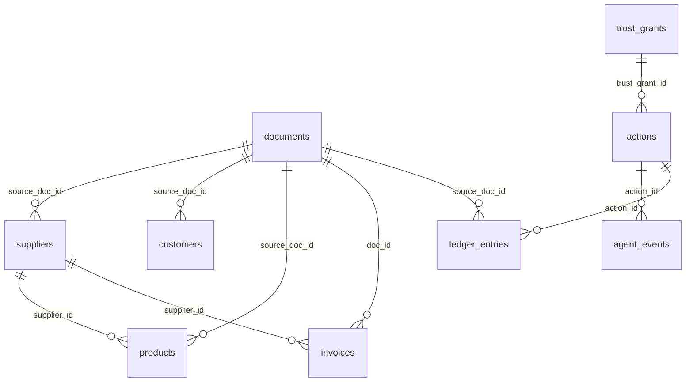

# Schema Documentation

> **Source of truth**: [`db/migrations/001_init.sql`](file:///c:/Users/gunde/Desktop/otto/db/migrations/001_init.sql) through [`004_theme2_domain_engine.sql`](file:///c:/Users/gunde/Desktop/otto/db/migrations/004_theme2_domain_engine.sql).
> Schema runs identically on the local Docker PostgreSQL 16 (pgvector image) and on Supabase.

---

## Overview

Otto's data model is split into three logical layers:

| Layer | Tables | Purpose |
|---|---|---|
| **Ingestion** | `documents` | Every file the system has ever seen (invoices, receipts, WhatsApp exports). |
| **Business Entities** | `suppliers`, `customers`, `products`, `invoices`, `ledger_entries` | The owner's real-world data — extracted from documents or seeded. |
| **Agent Core** | `actions`, `agent_events`, `trust_grants` | The AI agent's decision log, audit trail, and graduated autonomy state. |
| **Education** *(migration 003)* | `knowledge_documents`, `conversations`, `generated_documents`, `recommendations` | Ask-Otto knowledge base, chat history, document generation, and smart recommendations. |

Every business entity carries **provenance columns** (`source_doc_id`, `confidence`) so every agent decision can be traced back to the document it was extracted from.

---

## ER Diagram (Compact)



---

## Extensions

| Extension | Migration | Purpose |
|---|---|---|
| `pgcrypto` | 001 | Provides `gen_random_uuid()` for all primary keys. |
| `vector` | 003 | pgvector — enables `vector(1536)` column type for semantic embeddings in `knowledge_documents`. |

The Docker image `pgvector/pgvector:pg16` (from [`docker-compose.yml`](file:///c:/Users/gunde/Desktop/otto/docker-compose.yml)) bundles both extensions.

---

## Table Reference

### 1. `documents`

**Migration**: 001_init.sql, 002_i18n.sql
**Purpose**: Immutable record of every ingested file. The `file_hash` (SHA-256) doubles as the LLM cache key — re-uploading the same invoice is a no-op.

| Column | Type | Nullable | Default | Constraints |
|---|---|---|---|---|
| `id` | `uuid` | NO | `gen_random_uuid()` | **PK** |
| `kind` | `text` | NO | — | `CHECK (kind IN ('invoice','ledger_page','receipt','whatsapp_export'))` |
| `file_name` | `text` | NO | — | — |
| `file_hash` | `text` | NO | — | **UNIQUE** — SHA-256, also the LLM cache key |
| `storage_path` | `text` | NO | — | Local path under `./data/uploads` |
| `status` | `text` | NO | `'pending'` | `CHECK (status IN ('pending','extracting','extracted','review','confirmed','failed'))` |
| `extraction` | `jsonb` | YES | — | Zod-validated extractor output |
| `field_confidence` | `jsonb` | YES | — | Per-field confidence scores, e.g. `{ "vendor_name": 0.97 }` |
| `error` | `text` | YES | — | Error message if extraction failed |
| `source_language` | `text` | YES | `'en'` | *(Migration 002)* Language of the source document |
| `created_at` | `timestamptz` | NO | `now()` | — |

**Design rationale**: `extraction` is JSONB rather than normalized columns because every document type (invoice vs. ledger page vs. receipt) has a different shape. Zod validation in the application layer enforces structure per `kind`.

---

### 2. `suppliers`

**Migration**: 001_init.sql, 002_i18n.sql
**Purpose**: Vendor master data. Created by extraction or manually seeded.

| Column | Type | Nullable | Default | Constraints |
|---|---|---|---|---|
| `id` | `uuid` | NO | `gen_random_uuid()` | **PK** |
| `name` | `text` | NO | — | — |
| `phone` | `text` | YES | — | — |
| `aliases` | `text[]` | NO | `'{}'` | Array of alternate names for entity resolution |
| `source_doc_id` | `uuid` | YES | — | **FK → documents(id)** |
| `confidence` | `real` | YES | — | Extraction confidence (0.0–1.0) |
| `preferred_language` | `text` | YES | `'en'` | *(Migration 002)* Used for WhatsApp message localization |
| `created_at` | `timestamptz` | NO | `now()` | — |

**Design rationale — `aliases text[]`**: Suppliers on Indian invoices appear under many names ("Sharma Fabrics", "Sharma Fab.", "Sharma Textiles"). The `aliases` array lets the entity-resolution pass merge duplicates without losing any name variant. A PostgreSQL array was chosen over a join table because the number of aliases per supplier is small (typically 2–5) and queries use `ANY(aliases)` rather than joins.

---

### 3. `customers`

**Migration**: 001_init.sql, 002_i18n.sql
**Purpose**: Customer master data. `dues_amount` is a denormalized summary — the `ledger_entries` table is the source of truth.

| Column | Type | Nullable | Default | Constraints |
|---|---|---|---|---|
| `id` | `uuid` | NO | `gen_random_uuid()` | **PK** |
| `name` | `text` | NO | — | — |
| `phone` | `text` | YES | — | — |
| `aliases` | `text[]` | NO | `'{}'` | Same entity-resolution pattern as suppliers |
| `dues_amount` | `numeric(12,2)` | NO | `0` | Denormalized outstanding balance |
| `source_doc_id` | `uuid` | YES | — | **FK → documents(id)** |
| `confidence` | `real` | YES | — | — |
| `preferred_language` | `text` | YES | `'en'` | *(Migration 002)* |
| `created_at` | `timestamptz` | NO | `now()` | — |

---

### 4. `products`

**Migration**: 001_init.sql
**Purpose**: Inventory catalog. The `reorder_point` / `reorder_qty` pair drives the agent's automatic reorder flow.

| Column | Type | Nullable | Default | Constraints |
|---|---|---|---|---|
| `id` | `uuid` | NO | `gen_random_uuid()` | **PK** |
| `name` | `text` | NO | — | — |
| `sku` | `text` | YES | — | **UNIQUE** |
| `unit` | `text` | NO | `'pcs'` | Unit of measure |
| `unit_price` | `numeric(12,2)` | YES | — | — |
| `stock_qty` | `numeric(12,2)` | NO | `0` | Current inventory level |
| `reorder_point` | `numeric(12,2)` | YES | — | Trigger threshold — inferred from purchase frequency or seeded |
| `reorder_qty` | `numeric(12,2)` | YES | — | How many units to reorder |
| `supplier_id` | `uuid` | YES | — | **FK → suppliers(id)** |
| `price_history` | `jsonb` | NO | `'[]'` | Array of `{date, price, doc_id}` objects |
| `source_doc_id` | `uuid` | YES | — | **FK → documents(id)** |
| `confidence` | `real` | YES | — | — |
| `created_at` | `timestamptz` | NO | `now()` | — |

**Design rationale — `price_history jsonb`**: Price history is a time-series that is write-once, read-rarely (only used for trend analysis in the agent's reasoning). Storing it as a JSONB array avoids a dedicated join table and keeps the product row self-contained. Each entry references the `doc_id` of the invoice that established the price.

**Partial index**: `idx_products_reorder ON products(id) WHERE reorder_point IS NOT NULL` — the reorder scan only queries products that have a configured threshold.

---

### 5. `invoices`

**Migration**: 001_init.sql
**Purpose**: Supplier invoices — either extracted from uploaded documents or created by the agent's reorder flow.

| Column | Type | Nullable | Default | Constraints |
|---|---|---|---|---|
| `id` | `uuid` | NO | `gen_random_uuid()` | **PK** |
| `supplier_id` | `uuid` | YES | — | **FK → suppliers(id)** |
| `invoice_no` | `text` | YES | — | Vendor's invoice number |
| `invoice_date` | `date` | YES | — | — |
| `due_date` | `date` | YES | — | — |
| `total` | `numeric(12,2)` | YES | — | — |
| `line_items` | `jsonb` | NO | `'[]'` | Array of `{product_name, qty, unit_price, amount, product_id?}` |
| `doc_id` | `uuid` | YES | — | **FK → documents(id)** — the source document |
| `status` | `text` | NO | `'recorded'` | `CHECK (status IN ('recorded','due','paid'))` |
| `created_at` | `timestamptz` | NO | `now()` | — |

**Design rationale — `line_items jsonb`**: Invoice line items are semi-structured (Indian invoices can have variable column layouts) and are always read with the parent row. JSONB avoids a line-items join table and keeps reads as a single row fetch.

---

### 6. `ledger_entries`

**Migration**: 001_init.sql
**Purpose**: Append-only double-entry-style ledger. The source of truth for all money movements — `customers.dues_amount` is a derived cache.

| Column | Type | Nullable | Default | Constraints |
|---|---|---|---|---|
| `id` | `uuid` | NO | `gen_random_uuid()` | **PK** |
| `entity_type` | `text` | NO | — | `CHECK (entity_type IN ('supplier','customer'))` |
| `entity_id` | `uuid` | NO | — | References either `suppliers(id)` or `customers(id)` — polymorphic FK |
| `direction` | `text` | NO | — | `CHECK (direction IN ('debit','credit'))` |
| `amount` | `numeric(12,2)` | NO | — | `CHECK (amount >= 0)` |
| `description` | `text` | NO | — | — |
| `source_doc_id` | `uuid` | YES | — | **FK → documents(id)** |
| `action_id` | `uuid` | YES | — | **FK → actions(id)** — set when created by an agent action |
| `created_at` | `timestamptz` | NO | `now()` | — |

**Index**: `idx_ledger_entity ON ledger_entries(entity_type, entity_id)` — composite index for the common query pattern "all ledger entries for customer X".

---

### 7. `actions`

**Migration**: 001_init.sql, 003_education.sql, 004_theme2_domain_engine.sql
**Purpose**: The agent's action log. Every decision Otto makes — from drafting a PO to sending a payment reminder — is an `actions` row. Status transitions are guarded by `UPDATE ... WHERE status = $expected` inside a transaction for idempotent approval.

| Column | Type | Nullable | Default | Constraints |
|---|---|---|---|---|
| `id` | `uuid` | NO | `gen_random_uuid()` | **PK** |
| `type` | `text` | NO | — | See constraint below |
| `status` | `text` | NO | `'perceived'` | `CHECK (status IN ('perceived','planned','drafted','awaiting_approval','approved','rejected','executing','executed','undone','failed'))` |
| `payload` | `jsonb` | NO | `'{}'` | Typed per action (e.g. drafted PO, extraction ref, reminder text) |
| `reasoning` | `text` | YES | — | Agent's natural-language explanation — rendered on the UI card |
| `amount` | `numeric(12,2)` | YES | — | Money at stake — compared against trust cap for auto-approval |
| `approved_by` | `text` | YES | — | `CHECK (approved_by IN ('human','autonomy_grant'))` |
| `trust_grant_id` | `uuid` | YES | — | **FK → trust_grants(id)** — set when auto-approved |
| `undo_deadline` | `timestamptz` | YES | — | 1-hour window on auto-executed actions |
| `created_at` | `timestamptz` | NO | `now()` | — |
| `updated_at` | `timestamptz` | NO | `now()` | — |

**Action types** (after migration 004):
`invoice_commit`, `reorder`, `payment_reminder`, `graduation_offer`, `resurrection_commit`, `admission_processing`, `attendance_report`, `workflow_approval`, `document_generation`, `support_response`, `knowledge_answer`, `personalization_plan`

**Design rationale — `payload jsonb`**: Each action type has a different data shape — a reorder payload carries `{ po_number, items, supplier_id }` while a payment reminder carries `{ customer_id, message_text, channel }`. JSONB lets the `actions` table serve as a polymorphic action log without per-type tables. Type-specific Zod schemas validate the payload in application code.

**Indexes**: `idx_actions_status` (feed filtering) and `idx_actions_created` (reverse-chronological feed).

---

### 8. `agent_events`

**Migration**: 001_init.sql
**Purpose**: **Append-only** audit trail and live UI trace. Events are streamed over SSE to power the real-time activity feed. This table is BOTH the audit log and the rendering source — no separate "UI events" table exists.

| Column | Type | Nullable | Default | Constraints |
|---|---|---|---|---|
| `id` | `bigint` | NO | `GENERATED ALWAYS AS IDENTITY` | **PK** — monotonically increasing for SSE cursor |
| `action_id` | `uuid` | YES | — | **FK → actions(id)** |
| `from_state` | `text` | YES | — | Previous status (null for narration events) |
| `to_state` | `text` | NO | — | New status, or `'narration'` for prose events |
| `detail` | `jsonb` | NO | `'{}'` | Event-specific metadata |
| `created_at` | `timestamptz` | NO | `now()` | — |

**Design rationale — `bigint IDENTITY` PK**: Unlike every other table (which uses UUID PKs), `agent_events` uses an auto-incrementing `bigint`. This is deliberate: the SSE endpoint uses `WHERE id > $last_seen_id` as its cursor, and a monotonically increasing integer is far more efficient for range scans than a UUID.

**Indexes**: `idx_agent_events_action` (join back to action) and `idx_agent_events_id` (SSE cursor scan).

---

### 9. `trust_grants`

**Migration**: 001_init.sql
**Purpose**: Graduated autonomy state machine. Tracks how many times the owner has approved a particular action type, and whether the agent has earned autonomous execution rights.

| Column | Type | Nullable | Default | Constraints |
|---|---|---|---|---|
| `id` | `uuid` | NO | `gen_random_uuid()` | **PK** |
| `action_type` | `text` | NO | — | **UNIQUE** — one trust grant per action type |
| `approvals_count` | `int` | NO | `0` | Running tally of human approvals |
| `autonomy_level` | `text` | NO | `'gated'` | `CHECK (autonomy_level IN ('gated','autonomous'))` |
| `amount_cap` | `numeric(12,2)` | YES | — | Max amount for auto-approved actions |
| `offered_at` | `timestamptz` | YES | — | When the graduation card was surfaced to the owner |
| `granted_at` | `timestamptz` | YES | — | When the owner accepted ("Earn it, Otto") |
| `revoked_at` | `timestamptz` | YES | — | One-toggle revoke by the owner |
| `created_at` | `timestamptz` | NO | `now()` | — |

**Design rationale — `UNIQUE` on `action_type`**: There is exactly one trust grant per action type. This constraint ensures the trust-check query is a simple `SELECT ... WHERE action_type = $type` returning at most one row. The seed data in [`db/seed.ts`](file:///c:/Users/gunde/Desktop/otto/db/seed.ts) pre-creates a trust grant for `'reorder'` with `approvals_count = 2` and `autonomy_level = 'gated'` — meaning the 3rd human approval triggers the graduation offer.

---

### 10. `knowledge_documents` *(Education)*

**Migration**: 003_education.sql
**Purpose**: The "Ask Otto" knowledge base. Stores institutional content (fee structures, admissions info, schedules, policies) with vector embeddings for semantic search.

| Column | Type | Nullable | Default | Constraints |
|---|---|---|---|---|
| `id` | `uuid` | NO | `gen_random_uuid()` | **PK** |
| `category` | `text` | NO | — | `CHECK (category IN ('fees','admissions','schedule','policy'))` |
| `title` | `text` | NO | — | — |
| `content` | `text` | NO | — | Full document text |
| `audience` | `text` | NO | — | `CHECK (audience IN ('student','parent','staff'))` |
| `embedding` | `vector(1536)` | YES | — | OpenAI-compatible embedding for semantic retrieval |
| `updated_at` | `timestamptz` | NO | `now()` | — |

---

### 11. `conversations` *(Education)*

**Migration**: 003_education.sql
**Purpose**: Chat history for the Ask Otto interface. Messages stored as JSONB array with source attribution.

| Column | Type | Nullable | Default | Constraints |
|---|---|---|---|---|
| `id` | `uuid` | NO | `gen_random_uuid()` | **PK** |
| `audience` | `text` | NO | — | `CHECK (audience IN ('student','parent','staff'))` |
| `messages` | `jsonb` | NO | `'[]'` | Array of `{role, content, source_ids?}` |
| `created_at` | `timestamptz` | NO | `now()` | — |

---

### 12. `generated_documents` *(Education)*

**Migration**: 003_education.sql
**Purpose**: Documents generated by the agent — admission letters, fee invoices, report cards, question papers, circulars.

| Column | Type | Nullable | Default | Constraints |
|---|---|---|---|---|
| `id` | `uuid` | NO | `gen_random_uuid()` | **PK** |
| `type` | `text` | NO | — | `CHECK (type IN ('admission_letter','fee_invoice','report_card','question_paper','circular'))` |
| `recipient_name` | `text` | NO | — | — |
| `status` | `text` | NO | `'draft'` | `CHECK (status IN ('draft','ready','sent'))` |
| `content_ref` | `text` | YES | — | Path or URL to the generated PDF/HTML |
| `tenant_id` | `uuid` | YES | — | Multi-tenant scoping |
| `created_at` | `timestamptz` | NO | `now()` | — |

---

### 13. `recommendations` *(Education)*

**Migration**: 003_education.sql
**Purpose**: Smart recommendations surfaced in the "For You" tab — attendance deviations, quiz score trends, response rate anomalies.

| Column | Type | Nullable | Default | Constraints |
|---|---|---|---|---|
| `id` | `uuid` | NO | `gen_random_uuid()` | **PK** |
| `student_id` | `text` | YES | — | — |
| `class_id` | `text` | YES | — | — |
| `type` | `text` | NO | — | e.g. `attendance_deviation`, `quiz_score_trend`, `response_rate` |
| `reasoning` | `text` | NO | — | Natural-language explanation |
| `computed_from` | `jsonb` | NO | — | References specific data points used to generate the recommendation |
| `created_at` | `timestamptz` | NO | `now()` | — |
| `dismissed_at` | `timestamptz` | YES | — | Set when the user dismisses the card |

---

## Indexes

All indexes are defined in [`001_init.sql`](file:///c:/Users/gunde/Desktop/otto/db/migrations/001_init.sql) lines 137–142:

| Index | Table | Columns / Condition | Purpose |
|---|---|---|---|
| `idx_agent_events_action` | `agent_events` | `(action_id)` | Join events back to their parent action |
| `idx_agent_events_id` | `agent_events` | `(id)` | SSE cursor: `WHERE id > $last_seen` |
| `idx_actions_status` | `actions` | `(status)` | Filter the action feed by status |
| `idx_actions_created` | `actions` | `(created_at DESC)` | Reverse-chronological feed ordering |
| `idx_products_reorder` | `products` | `(id) WHERE reorder_point IS NOT NULL` | Partial index — only products with reorder thresholds |
| `idx_ledger_entity` | `ledger_entries` | `(entity_type, entity_id)` | Composite — "all entries for customer X" |

---

## Connection Configuration

From [`src/lib/db.ts`](file:///c:/Users/gunde/Desktop/otto/src/lib/db.ts):

```typescript
postgres(env.DATABASE_URL, {
  max: 10,                       // connection pool size
  idle_timeout: 30,              // seconds before idle connections are closed
  max_lifetime: 60 * 30,         // 30 minutes max connection lifetime
  transform: postgres.camel,     // snake_case columns ⇄ camelCase in TypeScript
  onnotice: () => {},            // suppress PostgreSQL NOTICE messages
});
```

The client uses a **global singleton pattern** (`globalThis.__ottoSql`) to survive Next.js hot-reload in development without leaking connections.

---

## Migration History

| Migration | File | What It Does |
|---|---|---|
| 001 | `001_init.sql` | Core schema: 9 tables, pgcrypto extension, all indexes |
| 002 | `002_i18n.sql` | Adds `source_language` to documents, `preferred_language` to customers and suppliers |
| 003 | `003_education.sql` | pgvector extension, 4 education tables, extends `actions.type` constraint |
| 004 | `004_theme2_domain_engine.sql` | Extends `actions.type` with cross-domain action families |

Migrations are run via `pnpm db:migrate` which executes [`scripts/migrate.ts`](file:///c:/Users/gunde/Desktop/otto/scripts/migrate.ts).

---

## Seed Data

The [`db/seed.ts`](file:///c:/Users/gunde/Desktop/otto/db/seed.ts) script creates a demo tenant — **"Priya's Fashion, Jaipur"** — with:

- **30 products** (dupattas, kurtis, sarees, leggings, etc.) with SKUs, prices, stock levels, reorder points, and supplier assignments
- **2 suppliers**: Sharma Fabrics (aliases: "Sharma Fab.", "Sharma Textiles") and Meena Silks (alias: "Meena Silk House")
- **8 customers** with phone numbers; 5 have outstanding dues (Rahul Deep owes ₹8,000)
- **3 pending supplier invoices** (2 overdue, 1 upcoming)
- **Trust history**: 2 pre-approved reorder actions — the 3rd approval triggers the graduation offer (Flow B)

The seed truncates all tables with `RESTART IDENTITY CASCADE` before inserting. Run via `pnpm db:seed`.
