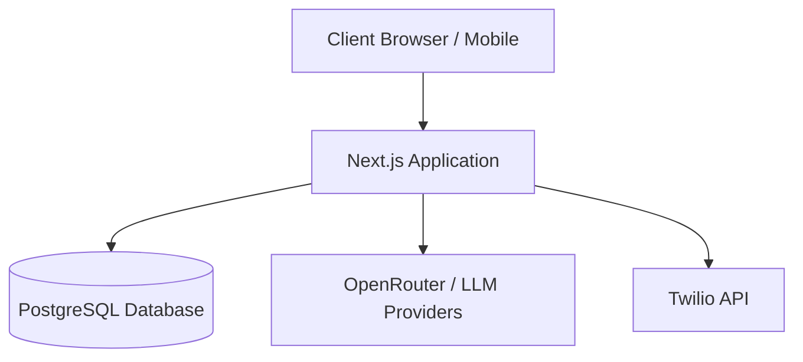

# Infrastructure Overview

This document provides a high-level overview of the infrastructure components required to run the Otto application in a production environment.

## Architecture

Otto is built as a monolithic Next.js application that handles both the frontend React components and the backend API routes.

## Key Components

### 1. Web Application (Next.js)
- **Framework**: Next.js 14 (App Router)
- **Runtime**: Node.js >= 18.17.0
- **Responsibilities**:
  - Serving the frontend UI (Approval Feed, Dashboards).
  - Handling API requests (`/api/ingest`, `/api/agent`, etc.).
  - Orchestrating the Agent Core logic (machine, gate, trust).
- **Hosting Recommendations**: Vercel, AWS ECS/Fargate, or traditional Node.js servers behind a reverse proxy (like Nginx).

### 2. Database (PostgreSQL)
- **Engine**: PostgreSQL 16
- **Extensions**: `pgvector`
- **Driver**: `postgres.js` (No ORM)
- **Responsibilities**:
  - Storing tenant data (products, suppliers, customers, invoices).
  - Maintaining the state of the agent system (actions, agent_events, trust_grants).
- **Hosting Recommendations**: Managed PostgreSQL services such as Supabase, AWS RDS, or Google Cloud SQL. *Docker is only used for local development.*

### 3. External Services
Otto relies on external APIs to function fully:
- **OpenRouter (LLM)**: Primary inference engine for extraction and decision-making. Requires outbound network access and API keys.
- **Twilio**: Used for WhatsApp integration and notifications.

### 4. Background Processing (pg-boss)
Otto utilizes `pg-boss` (as seen in `package.json`) for job queueing and background task management directly on top of PostgreSQL. This avoids the need for a separate Redis instance for simple task orchestration.

## Environment Variables
The infrastructure must securely provide the following key environment variables to the Next.js application runtime:
- `DATABASE_URL`: Connection string to the PostgreSQL instance.
- `OPENROUTER_API_KEY`: Key for LLM access.
- `TWILIO_*`: Keys for WhatsApp/SMS integration.
- `EXTRACTOR_MODE`: Controls mock vs. real extraction.
- `OTTO_ENGINE_URL` / `OTTO_ENGINE_KEY`: For integrating with the standalone Otto Workflow Engine (if applicable).
